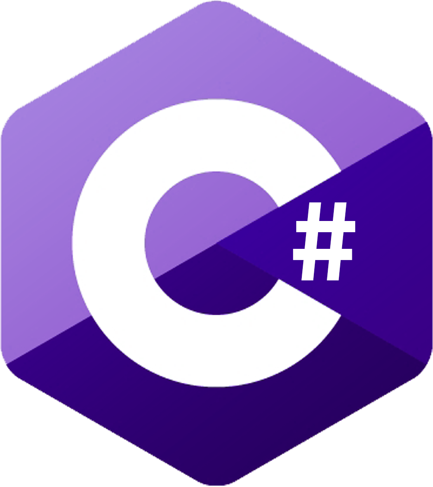
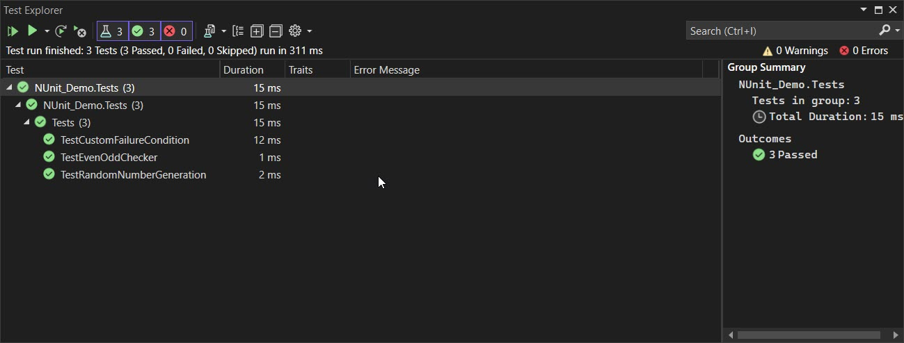
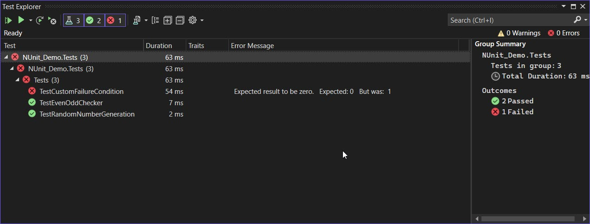

<!-- Begin README -->

<div align="center">
    <a href="https://github.com/scottgriv/csharp-nunit_demo_app" target="_blank">
        
    </a>
</div>
<br>
<p align="center">
    <a href="https://docs.microsoft.com/en-us/dotnet/csharp/"></a>
    <br>
    <a href="https://github.com/scottgriv"></a>
    <a href="mailto:scott.grivner@gmail.com"></a>
    <a href="https://www.buymeacoffee.com/scottgriv"></a>
    <br>
    <a href="https://prgoptimized.com" target="_blank"></a>
</p>

---------------

<h1 align="center">C# NUnit Demo Application</h1>

This is a demo application for the Microsoft .NET Core `NUnit` unit testing framework.
- It consists of two projects: `NUnitDemo` and `NUnitDemo.Tests`. 
- The `NUnitDemo` project is a simple ASP.NET Core application consisting of two class files.
- The `NUnitDemo.Tests` project is a test project that contains unit tests for the `NUnitDemo` project.

---------------

## Table of Contents

- [Getting Started](#getting-started)
- [Running the Tests](#running-the-tests)
- [References](#references)
- [License](#license)
- [Credits](#credits)

## Getting Started

How to add `NUnit` framework to your ASP.NET Core Web API project.
1. Create a new blank solution in Visual Studio.
2. Create another project in the solution and select `Test` -> `Unit Test Project (.NET Core)` and name it `NUnitDemo.Tests`.
    - This will create a new project with a `UnitTest1.cs` file using the `MSTest` framework.
3. Right click on the `NUnitDemo.Tests` project and select `Manage NuGet Packages`.
4. Search for `NUnit` using the `NuGet` package manager.
5. Install the following packages:
    - `NUnit`
    - `NUnit3TestAdapter`
6. Click the `Build` menu and select `Build Solution` to build your project.
7. Click the `Test` menu and select `Run All Tests` to run your tests.
8. You should see the following output in the `Test Explorer` window:
```
Total tests: 2. Passed: 3. Failed: 0. Skipped: 0.
```


> [!NOTE]
>  It doesn't matter if you use the default `MSTest` framework or the `NUnit` framework. You can use both in the same project. The important thing is that you're conducting unit tests to make your code more reliable.

**Unit Testing** is a pivotal part of the [Test Driven Development (TDD)](https://en.wikipedia.org/wiki/Test-driven_development) process. It is a software development process that relies on the repetition of a very short development cycle: requirements are turned into very specific test cases, then the software is improved to pass the new tests, only. This is opposed to software development that allows software to be added that is not proven to meet requirements.

## Running the Tests

Update the following line to `true` in the `NUnitDemo.Tests/UnitTest1.cs` file to see the tests fail.
```csharp
    bool breakTests = false; // To show failures in the unit tests, change this to true
```



## References

- [NUnit](https://nunit.org/)
- [NUnit Documentation](https://docs.nunit.org/)
- [Walkthrough: Creating and Running Unit Tests for Managed Code](https://learn.microsoft.com/en-us/visualstudio/test/walkthrough-creating-and-running-unit-tests-for-managed-code?view=vs-2022)
- [Unit testing with NUnit](https://learn.microsoft.com/en-us/dotnet/core/testing/unit-testing-with-nunit?source=recommendations)
- [Unit test basics](https://learn.microsoft.com/en-us/visualstudio/test/unit-test-basics?view=vs-2022)
- [What is unit testing?](https://www.techtarget.com/searchsoftwarequality/definition/unit-testing#:~:text=Unit%20testing%20is%20a%20software,tests%20during%20the%20development%20process)
- [Unit Testing Tutorial: What is, Types, Tools, EXAMPLE](https://www.guru99.com/unit-testing-guide.html)
- [Test Driven Development: By Example](https://www.amazon.com/Test-Driven-Development-Kent-Beck/dp/0321146530)
- [C# Documentation](https://docs.microsoft.com/en-us/dotnet/csharp/)

## License

This project is released under the terms of **The Unlicense**, which allows you to use, modify, and distribute the code as you see fit. 
- [The Unlicense](https://choosealicense.com/licenses/unlicense/) removes traditional copyright restrictions, giving you the freedom to use the code in any way you choose.
- For more details, see the [LICENSE](LICENSE) file in this repository.

## Credits

**Author:** [Scott Grivner](https://github.com/scottgriv) <br>
**Email:** [scott.grivner@gmail.com](mailto:scott.grivner@gmail.com) <br>
**Website:** [scottgrivner.dev](https://www.scottgrivner.dev) <br>
**Reference:** [Main Branch](https://github.com/scottgriv/csharp-nunit_demo_app) <br>

---------------

<div align="center">
    <a href="https://github.com/scottgriv" target="_blank">
        
    </a>
</div>

<!-- End README -->
